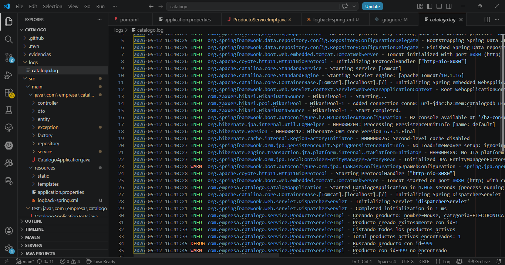
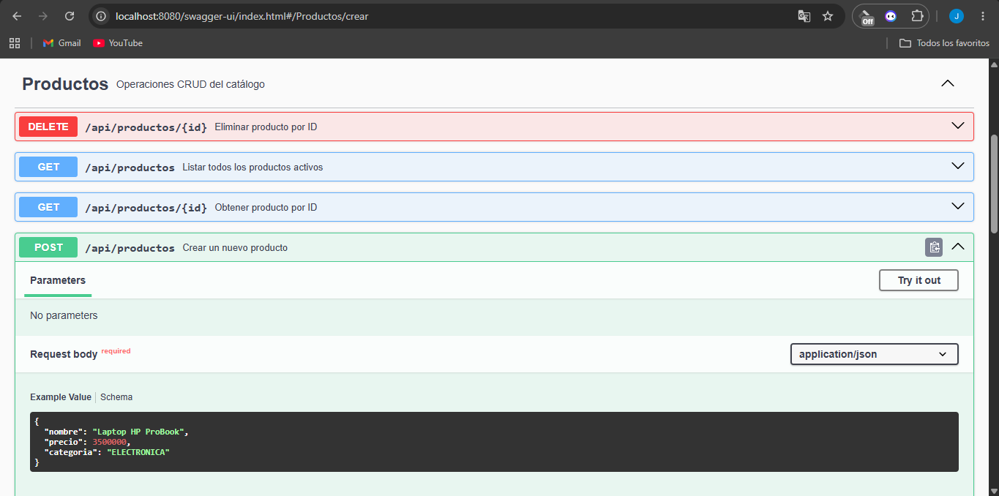

# Catálogo de Productos — Post-Contenido 2, Unidad 11

## Descripción

Extensión del proyecto Post-Contenido 1. Se integra SLF4J con Logback para 
registro de eventos con niveles apropiados y rotación de archivos, y se documenta 
la API REST completa con springdoc-openapi generando una Swagger UI interactiva.

## Arquitectura implementada
Controller → Service (interfaz/DIP) → Repository (DAO)
↑                          ↑
ProductoFactory            Producto (Entity)
(DTO ↔ Entity)
↑
ProductoRequestDTO (@Schema) / ProductoResponseDTO
↑
GlobalExceptionHandler (@RestControllerAdvice)
↑
ProductoServiceImpl (SLF4J Logger — INFO / WARN / DEBUG)
↑
logback-spring.xml (Consola + Archivo rotativo 30 días)

## Cómo ejecutar

1. Clonar el repositorio: https://github.com/Johan09CD/Carre-o-post2-u11-ProWeb
2. Desde la raíz del proyecto ejecutar:

mvn spring-boot:run

3. La API queda disponible en:
   http://localhost:8080/api/productos

4. Swagger UI disponible en:
   http://localhost:8080/swagger-ui.html

5. Los archivos de log se generan en la carpeta:
   logs/catalogo.log

## Endpoints

| Método | URL | Descripción | Respuestas |
|--------|-----|-------------|------------|
| GET | /api/productos | Lista productos activos | 200 |
| GET | /api/productos/{id} | Busca por ID | 200, 404 |
| POST | /api/productos | Crea un producto | 201, 400 |
| DELETE | /api/productos/{id} | Elimina un producto | 204, 404 |

## Logging implementado

| Nivel | Cuándo se usa |
|-------|--------------|
| INFO | Operaciones exitosas (crear, listar, eliminar) |
| WARN | Recurso no encontrado |
| DEBUG | Búsqueda por ID (inicio de operación) |

## Principios aplicados

- **SLF4J:** logger estático en ProductoServiceImpl con placeholders {}
- **Logback:** appender de consola y appender de archivo con rotación diaria
- **Rotación:** historial de 30 días en logs/catalogo.%d{yyyy-MM-dd}.log
- **OpenAPI:** @OpenAPIDefinition en la clase principal
- **@Tag:** agrupa los endpoints bajo "Productos"
- **@Operation:** describe cada endpoint
- **@ApiResponse:** documenta códigos 200, 201, 400, 404
- **@Schema:** documenta campos del DTO con ejemplos y valores permitidos

---

## Evidencias

### Checkpoint 1 — Mensajes SLF4J en consola
Verificación de que los mensajes de log aparecen en consola con el formato
configurado en logback-spring.xml (timestamp, nivel, logger, mensaje) al realizar
operaciones sobre la API.

---

### Checkpoint 2 — Archivo de log generado
Verificación de que el archivo `logs/catalogo.log` fue creado correctamente y
contiene los registros de las operaciones realizadas con el formato de fecha completo
configurado en el RollingFileAppender.

---

### Checkpoint 3 — Swagger UI con endpoints documentados
Verificación de que Swagger UI es accesible en `/swagger-ui.html` y muestra el
grupo "Productos" con los 4 endpoints documentados, incluyendo descripciones,
parámetros y códigos de respuesta 200, 201, 400 y 404.

