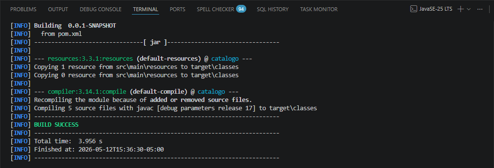
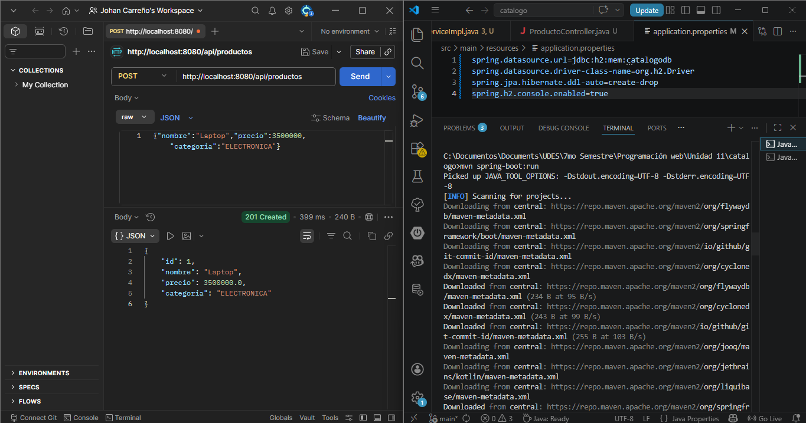
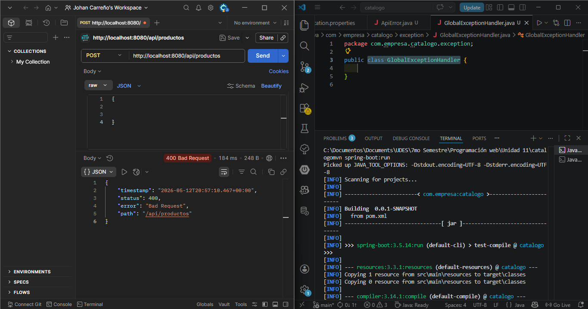
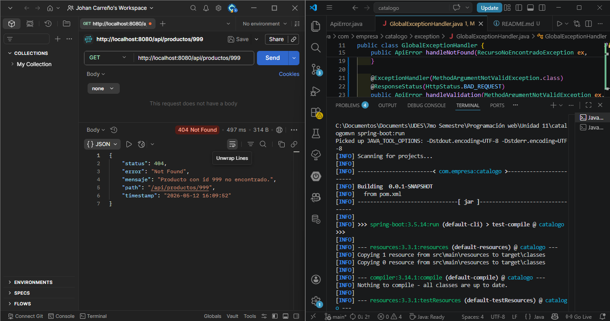

# Catálogo de Productos — Post-Contenido 1, Unidad 11

## Arquitectura implementada
Controller → Service (interfaz/DIP) → Repository (DAO)
↑                          ↑
ProductoFactory            Producto (Entity)
(DTO ↔ Entity)
↑
ProductoRequestDTO / ProductoResponseDTO
↑
GlobalExceptionHandler (@RestControllerAdvice)

## Cómo ejecutar

1. Clonar el repositorio: https://github.com/Johan09CD/Carre-o-post1-u11-ProWeb
2. Desde la raíz del proyecto ejecutar:

mvn spring-boot:run

3. La API queda disponible en http://localhost:8080/api/productos

## Endpoints

| Método | URL | Descripción |
|--------|-----|-------------|
| GET | /api/productos | Lista productos activos |
| GET | /api/productos/{id} | Busca por ID |
| POST | /api/productos | Crea un producto |
| DELETE | /api/productos/{id} | Elimina un producto |

## Principios aplicados

- **SRP:** cada clase tiene una sola responsabilidad
- **DIP:** el controller depende de la interfaz ProductoService, no de la implementación
- **DAO:** ProductoRepository extiende JpaRepository
- **DTO:** separación entre datos de entrada (RequestDTO) y salida (ResponseDTO)
- **Factory:** ProductoFactory centraliza la conversión entidad ↔ DTO

---

## Evidencias

### Checkpoint 1 — Compilación exitosa
Verificación de que el proyecto compila sin errores con `mvn compile`.

---

### Checkpoint 2 — POST exitoso (201 Created)
Creación de un producto enviando el request al endpoint `POST /api/productos`,
retornando el DTO de respuesta con el `id` generado por la base de datos.

---

### Checkpoint 3 — Manejo de errores

#### Error 400 — Validación de campos requeridos
Request enviado con body vacío a `POST /api/productos`. El `GlobalExceptionHandler`
intercepta el `MethodArgumentNotValidException` y retorna los mensajes de validación.

#### Error 404 — Recurso no encontrado
Request `GET /api/productos/999` sobre un ID inexistente. El `GlobalExceptionHandler`
intercepta el `RecursoNoEncontradoException` y retorna el `ApiError` con status 404.

